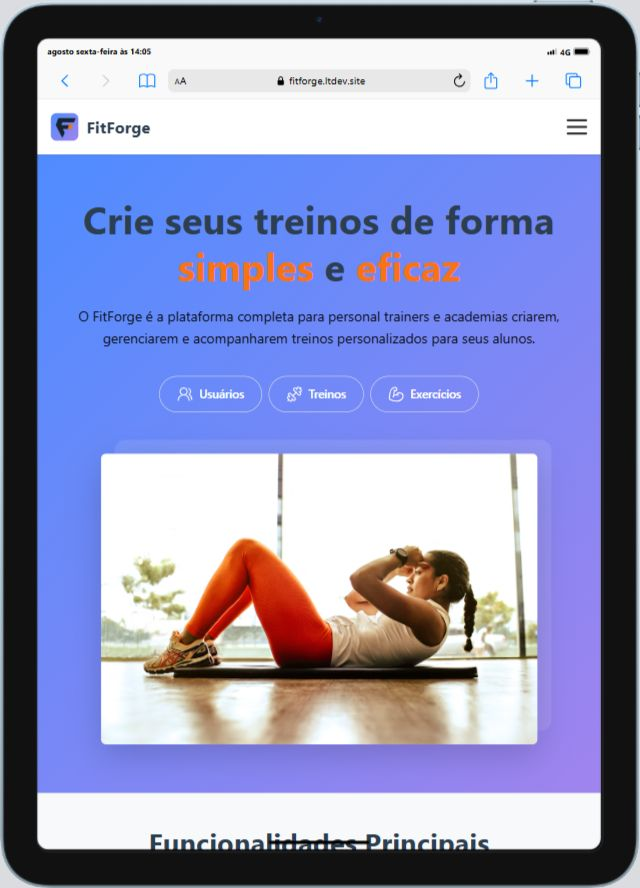
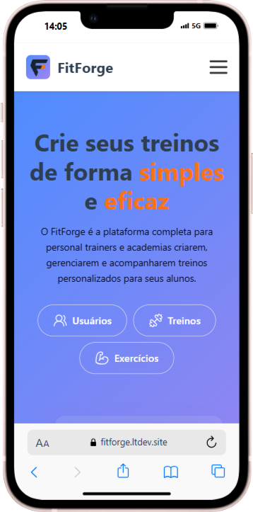
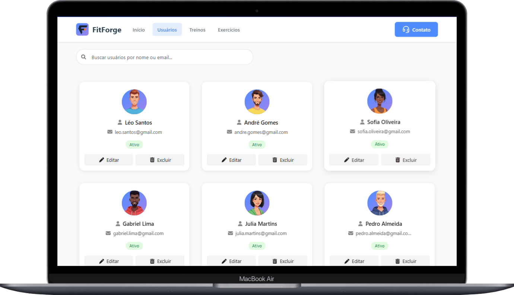
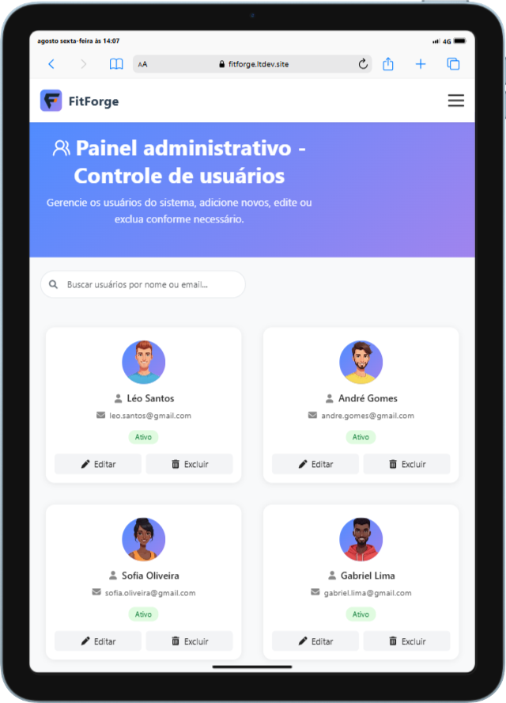
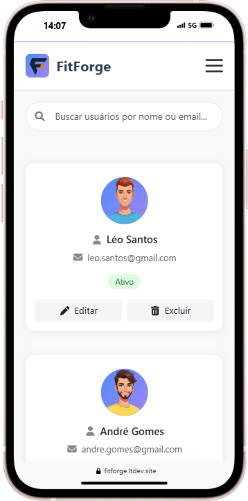
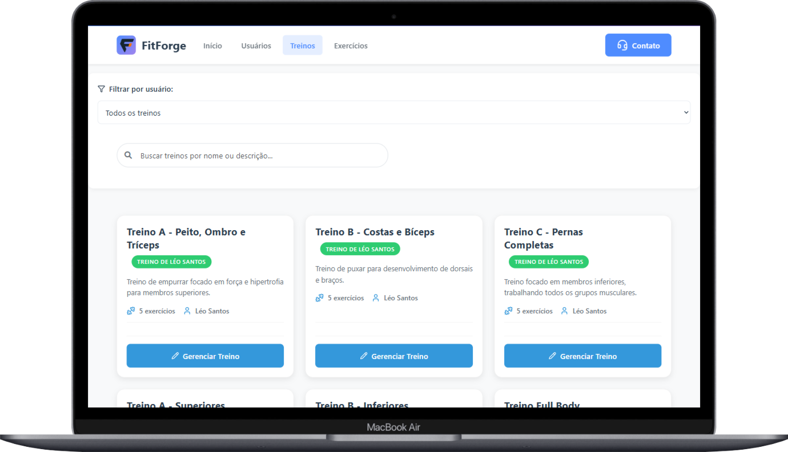
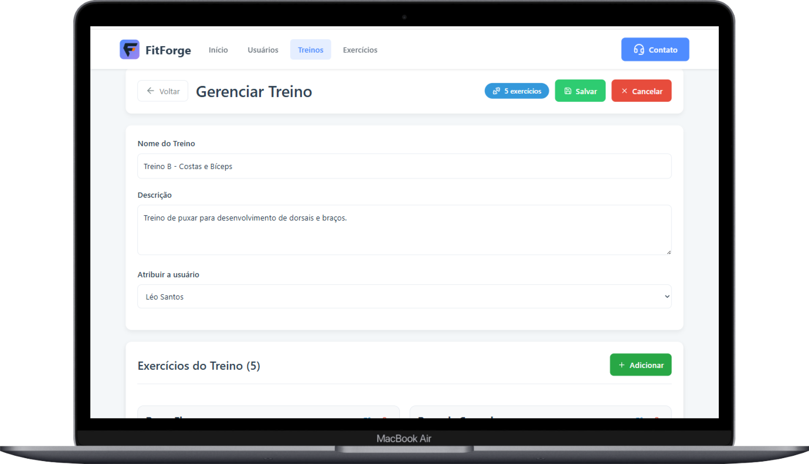
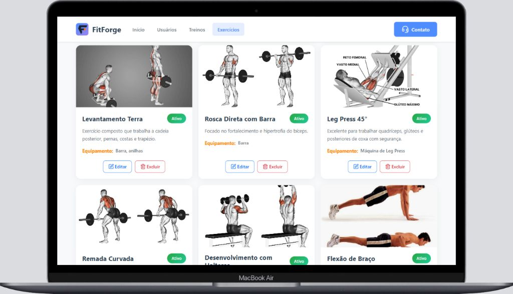

  <h1>FitForge</h1>

  

      <strong>FitForge</strong> é um sistema web desenvolvido como projeto de vitrine para demonstrar um possível sistema interno de gerenciamento de alunos, treinos e exercícios voltado a personal trainers. O objetivo principal é servir como uma <strong>"vitrine" funcional</strong> que apresenta fluxos típicos (CRUD de usuários, treinos e exercícios) e integração frontend ↔ backend, sem entrar na complexidade de autenticação e controle de acesso — por isso <strong>não há sistema de login</strong> neste projeto.
  

  <h2 style="border-bottom: 2px solid #3498db; padding-bottom: 10px;">🔗 Links</h2>
  <ul>
      <li style="border-left: 4px solid #3498db; padding: 10px 15px; margin-bottom: 8px; background-color: #f8f9fa; border-radius: 4px;"><strong>Site oficial:</strong> <a href="https://fitforge.ltdev.site" target="_blank">https://fitforge.ltdev.site</a></li>
      <li style="border-left: 4px solid #3498db; padding: 10px 15px; margin-bottom: 8px; background-color: #f8f9fa; border-radius: 4px;"><strong>Repositório (frontend):</strong> <a href="https://github.com/LeandroTanner/fitforge-frontend.git" target="_blank">https://github.com/LeandroTanner/fitforge-frontend.git</a></li>
      <li style="border-left: 4px solid #3498db; padding: 10px 15px; margin-bottom: 8px; background-color: #f8f9fa; border-radius: 4px;"><strong>API (endpoints principais):</strong> <a href="https://fitforgeapi.ltdev.site" target="_blank">https://fitforgeapi.ltdev.site</a>
          <ul>
              <li style="border-left: none; padding: 5px 15px; margin-top: 5px;">Rotas principais: <code>/users</code>, <code>/workouts</code>, <code>/exercises</code></li>
          </ul>
      </li>
      <li style="border-left: 4px solid #3498db; padding: 10px 15px; margin-bottom: 8px; background-color: #f8f9fa; border-radius: 4px;"><strong>Portfólio:</strong> <a href="https://ltdev.site" target="_blank">https://ltdev.site</a> <em>(Será atualizado em breve)</em></li>
  </ul>

<h2 style="border-bottom: 2px solid #3498db; padding-bottom: 10px;">Tecnologias utilizadas</h2>

| Frontend | Backend | Banco de Dados |
| :--- | :--- | :--- |
| <ul><li>React (Framework)</li><li>Bootstrap (Estilização)</li><li>FontAwesome (Ícones)</li><li>Lucide React (Ícones)</li><li>Axios (Requisições HTTP)</li><li>GetForm (Formulário)</li></ul> | <ul><li>Node.js</li><li>Express</li><li>CORS</li><li>RateLimit</li><li>Prisma ORM</li></ul> | <ul><li>MongoDB</li><li>Mongo Atlas</li></ul> |

<h2 style="border-bottom: 2px solid #3498db; padding-bottom: 10px;">Arquitetura e hospedagem</h2>
<ul>
  <li style="border-left: 4px solid #3498db; padding: 10px 15px; margin-bottom: 8px; background-color: #f8f9fa; border-radius: 4px;"><strong>Frontend hospedado em:</strong> Vercel</li>
  <li style="border-left: 4px solid #3498db; padding: 10px 15px; margin-bottom: 8px; background-color: #f8f9fa; border-radius: 4px;"><strong>Backend hospedado em:</strong> Railway</li>
  <li style="border-left: 4px solid #3498db; padding: 10px 15px; margin-bottom: 8px; background-color: #f8f9fa; border-radius: 4px;"><strong>Banco de dados hospedado em:</strong> Mongo Atlas</li>
</ul>

A comunicação entre frontend e backend é feita via API REST na base <code>https://fitforgeapi.ltdev.site</code>, que expõe recursos para gerenciar usuários, treinos e exercícios.

<h2 style="border-bottom: 2px solid #3498db; padding-bottom: 10px;">Funcionalidades principais</h2>
<ul>
  <li style="border-left: 4px solid #3498db; padding: 10px 15px; margin-bottom: 8px; background-color: #f8f9fa; border-radius: 4px;">Listagem, criação, edição e exclusão de <strong>usuários</strong> (alunos).</li>
  <li style="border-left: 4px solid #3498db; padding: 10px 15px; margin-bottom: 8px; background-color: #f8f9fa; border-radius: 4px;">Listagem, criação, edição e exclusão de <strong>workouts</strong> (treinos).</li>
  <li style="border-left: 4px solid #3498db; padding: 10px 15px; margin-bottom: 8px; background-color: #f8f9fa; border-radius: 4px;">Listagem, criação, edição e exclusão de <strong>exercises</strong> (exercícios).</li>
  <li style="border-left: 4px solid #3498db; padding: 10px 15px; margin-bottom: 8px; background-color: #f8f9fa; border-radius: 4px;">Integração do frontend com a API usando Axios.</li>
  <li style="border-left: 4px solid #3498db; padding: 10px 15px; margin-bottom: 8px; background-color: #f8f9fa; border-radius: 4px;">Formulário de contato integrado via GetForm.</li>
  <li style="border-left: 4px solid #3498db; padding: 10px 15px; margin-bottom: 8px; background-color: #f8f9fa; border-radius: 4px;">Proteções no backend: CORS configurado e RateLimit para reduzir abuso de requisições.</li>
</ul>

<h2 style="border-bottom: 2px solid #3498db; padding-bottom: 10px;">Como testar a API</h2>

Você pode testar a API de duas formas principais: pela interface do site (frontend), assim você pode ter a experiencia de um usuário desse sistema (ex: personal trainer).

Caso queira testar a API diretamente em serviços como o Postman, peço que envie um email no formulário do site no final da página inicial (Clique no botão CONTATO e seja direcionado.) com o assunto <code>Solicitação de teste de api - FitForge</code>, para que eu forneça as credenciais públicas para seus testes. Para entender melhor, deixarei uma explicação abaixo.

<h2 style="color: #c0392b !important; font-weight: 700; border-bottom: none; margin-top: 0; font-size: 1.5em;">IMPORTANTE</h2>
<blockquote style="margin: 0; padding: 15px; border-left: 5px solid #c0392b; background-color: #fff;">
  <strong>A api não recebe requisições públicas?</strong>
  
É importante ressaltar que essa aplicação não possui autenticação de usuário, mas ainda assim possui credenciais. Como este é um projeto exposto publicamente e eu vou utilizá-lo para demonstrar meu conhecimento, eu não poderia deixar livre para que qualquer pessoa pudesse inserir textos e imagens no app sem controle nenhum.

</blockquote>
<blockquote style="margin: 15px 0 0 0; padding: 15px; border-left: 5px solid #c0392b; background-color: #fff;">
  <strong>Mas... Como resolver isso?</strong>
  
É aí que entra o "sistema de segurança" da minha api!   Para realizar requisições públicas, do tipo <code>GET</code>, o sistema aceita uma chave de api pública, utilizada no site, ou seja, os usuários que acessarem só podem ver os dados inseridos.  Para realizar gravação de dados no projeto { <code>POST</code>, <code>UPDATE</code>, <code>DELETE</code> } , é necessário uma chave de api privada que <strong>nunca</strong> será compartilhada.  Por isso que caso queira realizar testes no serviço, entre em contato por email, assim eu posso lhe fornecer a chave pública apenas para consulta de dados.

</blockquote>

<strong>Base da API:</strong> <code>https://fitforgeapi.ltdev.site</code>

<h2 style="border-bottom: 2px solid #3498db; padding-bottom: 10px;">Imagens do Projeto</h2>

Abaixo estão algumas capturas de tela que demonstram a interface e as funcionalidades do FitForge em diferentes dispositivos.

<table width="100%">
  <tr align="center">
    <td width="33%">
      
      
Página Inicial - Notebook

    </td>
    <td width="33%">
      
      
Página Inicial - Tablet

    </td>
    <td width="33%">
      
      
Página Inicial - Celular

    </td>
  </tr>
  <tr align="center">
    <td width="33%">
      
      
Listagem de Usuários - Notebook

    </td>
    <td width="33%">
      
      
Listagem de Usuários - Tablet

    </td>
    <td width="33%">
      
      
Listagem de Usuários - Celular

    </td>
  </tr>
  <tr align="center">
    <td width="33%">
      
      
Listagem de Treinos

    </td>
    <td width="33%">
      
      
Edição de Treino

    </td>
    <td width="33%">
      
      
Listagem de Exercícios

    </td>
  </tr>
</table>

